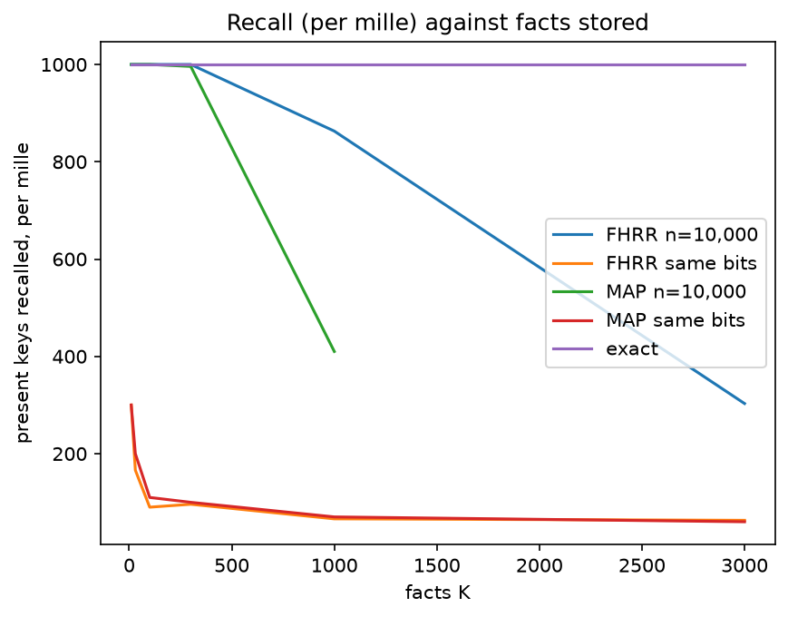

---
proof:
  source: "001_exact_memory_vs_noisy_vsa.py"
  sha256: "76c734372f522e6064f588d6fb575f59b6653e1018e2b90d32956d6ddc871c36"
  assertions: 14
  exit_code: 0
report:
  title: "001 — An exact associative memory beats a noisy VSA at every size and budget"
  sections: 5
  tables: 1
  figures: 1
---

# 001 — An exact associative memory beats a noisy VSA at every size and budget — Verified Computational Report

> Generated by `001_exact_memory_vs_noisy_vsa.py` — 14 assertions passed
> Source hash: `sha256:76c734372f522e6064f588d6fb575f59b6653e1018e2b90d32956d6ddc871c36`
> This report was produced as a side effect of verification.
> Its existence certifies that all claims below were computationally verified.
> To re-verify: run the source file and compare the hash in the footer.

## Research Brief

001 — An exact associative memory beats a noisy VSA at every size and budget

Promoted from exploration 036 (explorations/). Library: rhind.memory (ExactMemory).

K facts key → value are superposed into one exact rational, Σ v/q = N/D
(q: the key's prime; values 1 ≤ v < q). Recall reads v = N·(D/q)⁻¹ mod q;
an absent key is absent because q ∤ D. Merge and delete are + and −.
Compared with MAP-I, the standard bipolar VSA with integer bundles (random
±1 vectors, bind by elementwise product, bundle by integer sum; "MAP-I" in
Schlegel et al.'s taxonomy, where MAP-B would threshold the bundle to ±1;
named MAP-B here before 2026-10-02), clean-up by integer dot product
against the value vectors, "present" when the best score ≥ n/2), at two
sizes: n matched to the exact memory's bits, and n = 10,000. And with the
ideal packed table, K·(⌈log₂ keys⌉ + ⌈log₂ values⌉) bits, the floor for any
exact store. Universe: 20,000 keys, 1,000 values.

Predictions, on record BEFORE running (exploration 036 measured them):
  P1  ExactMemory recalls every present key and no absent key at every K,
      at ≈ 1.3× the ideal packed table (036: 1.20–1.30; asserted ≤ 1.35).
  P2  MAP-I at the same bits fails from the smallest K; at n = 10,000 it is
      perfect to K = 100, false-recalls by K = 300, and collapses by 1,000.
  P3  ExactMemory queries in microseconds at every K here, faster than
      MAP-I's clean-up (milliseconds).
  P4  Any sequence of inserts, deletes and merges leaves the memory equal to
      one rebuilt from scratch.

Added 2026-10-02 (the literature survey asked for the strongest dense VSA,
FHRR, next to MAP-I). FHRR: random phasors, bind by elementwise product
(phases add), bundle by sum, clean-up by the real part of the inner product.
Phases here are the 4th roots of unity, so every component is a Gaussian
integer and nothing needs a cosine. That loses nothing: for a uniform phase
on m ≥ 3 points (and for the continuous circle) the real part has mean 0
and variance exactly 1/2, so the noise each stored fact adds to a clean-up
score is the same for m = 4 as for continuous FHRR. Against MAP (variance
1) that halves the noise per dimension, but each component costs two
counters instead of one.

Predictions, on record BEFORE the FHRR runs (from that variance argument,
and the 036 numbers as calibration: clean-up succeeds while
n > ≈3.2·√(noise variance), the max of 1,000 wrong candidates):
  P5  FHRR at the exact memory's bits fails from the smallest K, like
      MAP-I: half the dimensions, each twice as clean, is no gain per bit.
  P6  FHRR at n = 10,000 holds about twice the facts MAP-I does: perfect
      recall to K = 300, ≈ 90% at K = 1,000 (MAP-I ≈ 50%), below half by
      K = 3,000; false recalls a few percent at K = 300, most by K = 1,000.

Added 2026-10-02 from exploration 040 (which measured it): Deng & Raviv's
exact VSA (arXiv 2511.01838). Reed–Solomon codewords over F_N, N = p^m,
through a Hadamard code to n = N² roots of unity; key and value own their
own RS blocks, so a bound pair has RS dimension k = ⌈log_N U⌉ + ⌈log_N V⌉.
Their formula (10) in its noiseless best case (s = r = e_g = 0, d = N−1)
recovers u ≤ ⌊(N−1)/(k−1)⌋ superposed pairs. A bundle entry, a sum of u
p-th roots of unity, is charged only its information content,
⌈log₂ C(u+p−1, p−1)⌉ bits; the cheapest prime power N ≤ 2^14 is taken.
Both choices favour them.
  P7  Deng–Raviv needs ≥ 30× the exact memory's bits at the smallest K and
      thousands of times by K = 3,000 (n = N² with N ≳ K·(k−1): bits grow
      ~ K² log K against the exact memory's linear growth). What that buys,
      noise tolerance, is outside this comparison.

Exact integers and Fractions; numpy is used only as an int64 array engine
for MAP-I. The plot receives integers. Timings are measurements, reported in
whole microseconds.

## P1–P3 — recall, false recalls, size and speed against MAP-I and the packed floor

**P1–P3**: exact recall and zero false recalls at every K, at ≈ 1.3× the packed floor and microsecond queries; MAP-I fails at the same bits from the smallest K and, at n = 10,000, collapses by K = 1,000

| facts K | exact: recall | exact: false | exact: bits | ÷ floor | exact: µs | MAP same bits: recall | MAP same bits: false | MAP: µs | MAP n=10,000: recall | MAP n=10,000: false |
| ---: | ---: | ---: | ---: | ---: | ---: | ---: | ---: | ---: | ---: | ---: |
| 10 | 10/10 | 0 | 327 | 1.30× | 1 | 3/10 | 300 | 32 | 10/10 | 0 |
| 30 | 30/30 | 0 | 990 | 1.32× | 0 | 6/30 | 300 | 72 | 30/30 | 0 |
| 100 | 100/100 | 0 | 3212 | 1.28× | 1 | 11/100 | 300 | 176 | 100/100 | 0 |
| 300 | 300/300 | 0 | 9720 | 1.29× | 2 | 30/300 | 300 | 416 | 299/300 | 267 |
| 1000 | 300/300 | 0 | 32396 | 1.29× | 6 | 21/300 | 300 | 1293 | 123/300 | 300 |
| 3000 | 300/300 | 0 | 97587 | 1.30× | 18 | 18/300 | 300 | 4123 | — | — |

**Legend:**
- **exact: false** — absent keys answered, of 300
- **÷ floor** — exact memory bits ÷ ideal packed table K·(15 + 10) bits
- **MAP same bits: recall** — MAP-I with n chosen so its counters use the exact memory's bits

## P5–P6 — FHRR, the strongest dense VSA, on the same facts

**P5–P6**: FHRR is no better than MAP-I per bit (half the dimensions, each twice as clean) and fails at the exact memory's bits from the smallest K; at n = 10,000 it holds about twice the facts MAP-I does, and still collapses while the exact memory stays exact

| facts K | FHRR same bits: n | FHRR same bits: recall | FHRR same bits: false | MAP same bits: recall | FHRR n=10,000: recall | FHRR n=10,000: false | MAP n=10,000: recall | FHRR: µs |
| ---: | ---: | ---: | ---: | ---: | ---: | ---: | ---: | ---: |
| 10 | 32 | 3/10 | 300 | 3/10 | 10/10 | 0 | 10/10 | 33 |
| 30 | 82 | 5/30 | 300 | 6/30 | 30/30 | 0 | 30/30 | 76 |
| 100 | 200 | 9/100 | 300 | 11/100 | 100/100 | 0 | 100/100 | 179 |
| 300 | 486 | 29/300 | 300 | 30/300 | 300/300 | 11 | 299/300 | 421 |
| 1000 | 1472 | 20/300 | 300 | 21/300 | 259/300 | 300 | 123/300 | 1401 |
| 3000 | 3753 | 19/300 | 300 | 18/300 | 91/300 | 300 | — | 4823 |

**Legend:**
- **FHRR same bits: n** — dimensions FHRR can afford at the exact memory's bits (two counters each)
- **FHRR same bits: false** — absent keys answered, of 300
- **MAP n=10,000: recall** — from the P1–P3 table, same facts

## P7 — Deng & Raviv's exact VSA: bits for the same facts

**P7**: the closest published exact VSA needs 50× the exact memory's bits at 10 facts and thousands of times at 3,000, even at its noiseless bound with information-content storage; its premium buys noise tolerance, which the exact memory does not have

| facts K | exact memory: bits | Deng–Raviv: bits | ÷ exact | field N | RS dimension |
| ---: | ---: | ---: | ---: | ---: | ---: |
| 10 | 327 | 16384 | 50× | 2^6 | 5 |
| 30 | 990 | 81920 | 82× | 2^7 | 5 |
| 100 | 3212 | 1835008 | 571× | 2^9 | 4 |
| 300 | 9720 | 9437184 | 970× | 2^10 | 3 |
| 1000 | 32396 | 41943040 | 1,294× | 2^11 | 3 |
| 3000 | 97587 | 805306368 | 8,252× | 2^13 | 3 |

**Legend:**
- **Deng–Raviv: bits** — cheapest N = p^m ≤ 2^14 at their noiseless bound, entries charged their information content
- **RS dimension** — ⌈log_N 20,000⌉ + ⌈log_N 1,000⌉

## P4 — exact under any sequence of inserts, deletes and merges

| operations | facts at the end | equals a rebuild | every fact recalls |
| ---: | ---: | --- | --- |
| 2000 | 2126 | yes | yes |

## Recall as the memory fills

*The exact memory stays at 1000 by construction. MAP-I at the same
bits never gets close; at n = 10,000 (many times the bits) it holds to
K ≈ 100 and then falls away. FHRR at n = 10,000 holds about twice as
long and falls away the same way.*

---
*Assertions: 14 | SHA-256: `76c734372f522e6064f588d6fb575f59b6653e1018e2b90d32956d6ddc871c36` | Exit: 0*
