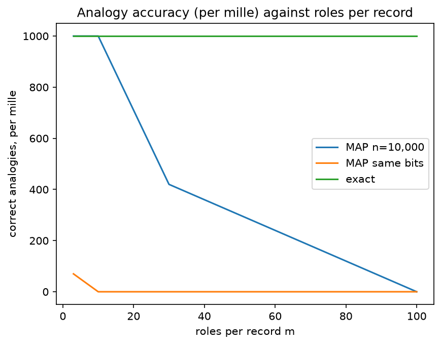

---
proof:
  source: "002_exact_holistic_operations.py"
  sha256: "ad554fe82608a080d55fb855fdb0d24d10d40f3188e9489caba7c89316502952"
  assertions: 6
  exit_code: 0
report:
  title: "002 — Exact holistic operations, and why re-binding cannot be one"
  sections: 3
  tables: 0
  figures: 1
---

# 002 — Exact holistic operations, and why re-binding cannot be one — Verified Computational Report

> Generated by `002_exact_holistic_operations.py` — 6 assertions passed
> Source hash: `sha256:ad554fe82608a080d55fb855fdb0d24d10d40f3188e9489caba7c89316502952`
> This report was produced as a side effect of verification.
> Its existence certifies that all claims below were computationally verified.
> To re-verify: run the source file and compare the hash in the footer.

## Research Brief

002 — Exact holistic operations, and why re-binding cannot be one

Promoted from exploration 037 (explorations/). Library: rhind.memory
(ExactMemory.key_bag / holding / analogy / agreeing / rebind).

VSAs are used for operations on whole structures: analogy through a mapping
vector, graded similarity between composite records, re-binding a role. A
record here is F = Σ v/q over role primes, with its key bag S = Σ 1/q.
  holding(x)   D / den(F − x·S): subtracting x from every value at once makes
               exactly the roles holding x vanish from the denominator
  analogy      "the x of A": the role holding x in B, then A's value there
  agreeing     lcm(D_A, D_B) / den(F_A − F_B): equal values cancel
  rebind       read, then write
Compared with MAP-I (bipolar atoms, integer bundles; named MAP-B here
before 2026-10-02): analogy = clean-up(x ⊙ A ⊙ B); agreeing
count = round(A·B / n); re-binding = read with clean-up, then rewrite. Kanerva
records scaled: m roles, 100 fillers per role, analogy pairs share no filler.

Predictions, on record BEFORE running (exploration 037 measured P1–P4):
  P1  Every exact operation is correct in every trial at every m.
  P2  MAP-I analogy at n = 10,000: ≥ 95% for m ≤ 10, < 50% at m = 100.
      MAP-I at the exact records' bits: < 50% at every m.
  P3  MAP-I exact agreeing-role count at n = 10,000: ≥ 95% for m ≤ 10,
      < 60% at m = 100.
  P4  MAP-I re-binding at n = 10,000: ≥ 95% at every m.
  P5  No additive map moves a value between keys: for primes p ≠ q every
      additive φ: ℤ/p → ℤ/q is zero, since φ(1) = c needs p·c ≡ 0 (mod q).
      So an exact memory, whose key-q value lives in ℤ/q, has no holistic
      re-binding; it must read. (VSAs re-bind linearly because all their roles
      share one group, which is also why they are noisy.) Checked exhaustively
      for all prime pairs below 200.

Exact integers and Fractions; numpy only as an int64 engine for MAP-I. The
plot receives integers.

## P1–P4 — analogy, agreeing roles and re-binding against MAP-I

**P1–P4**: every exact operation correct at every m, at a small fraction of MAP-I's storage; MAP-I's analogy and agreeing counts degrade with record size

| roles m | exact: all three ops | exact bits | MAP 10k: analogy | MAP 10k: agreeing count | MAP 10k: re-binding | MAP 10k bits | MAP same bits: analogy | same bits: agreeing | same bits: re-binding |
| ---: | ---: | ---: | ---: | ---: | ---: | ---: | ---: | ---: | ---: |
| 3 | 300/300 | 49 | 100 | 100 | 100 | 30000 | 7 | 35 | 16 |
| 10 | 300/300 | 201 | 100 | 100 | 100 | 50000 | 0 | 21 | 0 |
| 30 | 300/300 | 695 | 42 | 80 | 100 | 60000 | 0 | 11 | 1 |
| 100 | 300/300 | 2668 | 0 | 40 | 100 | 80000 | 0 | 6 | 0 |

**Legend:**
- **exact: all three ops** — correct operations of 300 (analogy, agreeing roles, re-binding)
- **MAP 10k: analogy** — correct of 100; analogy pairs share no filler (Kanerva's setting)

## P5 — no additive map moves a value between keys

*An additive φ: ℤ/p → ℤ/q is determined by c = φ(1) and needs
p·c ≡ 0 (mod q). Counting the admissible nonzero c for every pair:*

**P5**: every additive map between distinct prime keys is zero, so re-binding must read the value out to ℤ: there is no holistic exact form

| primes below | ordered pairs (p, q), p ≠ q | additive maps ℤ/p → ℤ/q other than 0 |
| ---: | ---: | ---: |
| 200 | 2070 | 0 |

## Analogy as records grow

*The exact analogy is correct at every size by construction. MAP-I's
mapping vector A ⊙ B carries m² cross terms, so its signal-to-noise
falls like √n/m: fine at n = 10,000 for small records, gone by m = 100,
and never usable at the exact records' storage.*

---
*Assertions: 6 | SHA-256: `ad554fe82608a080d55fb855fdb0d24d10d40f3188e9489caba7c89316502952` | Exit: 0*
